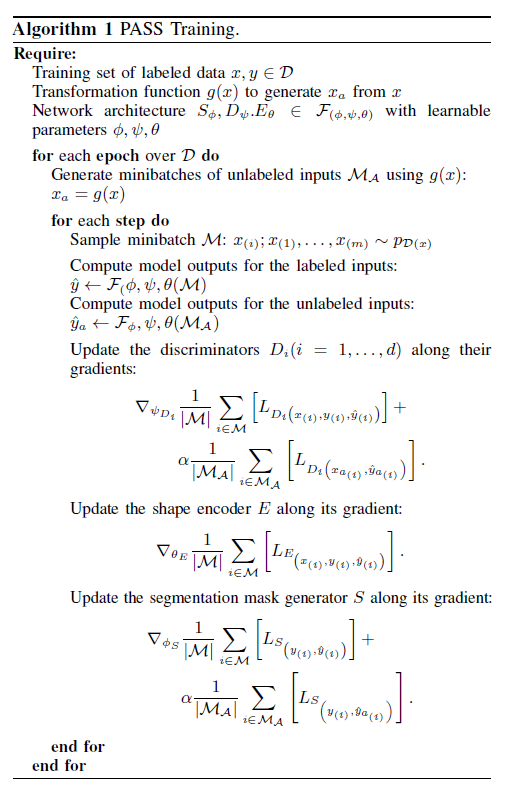
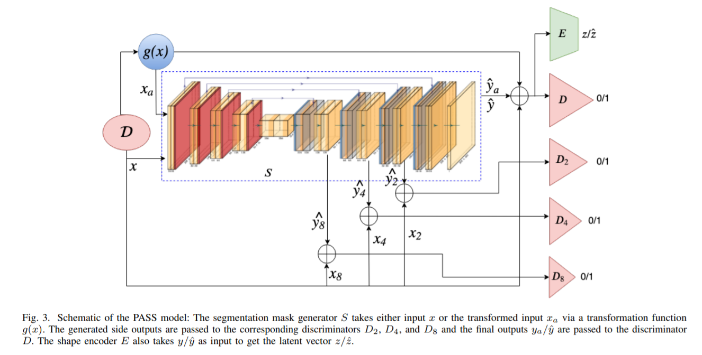
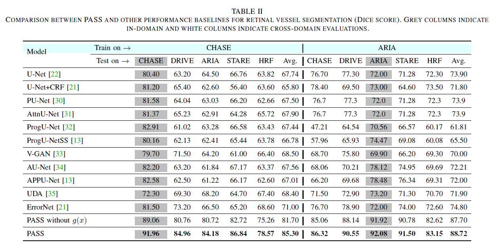

[arvix](https://arxiv.org/abs/2005.04311)

## 总体思路

通过Transformation产生出更多的数据，是一般的数据增广方式。但是这篇文章中，对于增广出来的数据，并不采用对应的label进行监督学习，而是视为unlabel的数据，这样增加了网络的泛化性，在不同的数据集上也能预测的很好。

<!-- more -->

## 网络结构、Loss和算法

下边我们直接看算法，算法如图，非常简单。

整体过程中有三个网络，Discriminators D, segmentation mask generator S和shape encoder E。

S负责输入图像，输出预测的Mask。

D输入图像和分割Mask（有GroundTruth，也有S预测的），判断MASK是GT还是网络预测的。

E输入Mask（有GroundTruth，也有S预测的），输出latent code.

### Loss 

#### 1. Segmentor Loss:

两部分，

1. 分割的loss，包含两部分：分割结果的KL divergence，以及Feature Loss
2. 来自Discriminator的Loss，和其他的GAN Loss一样

#### 2.  Discriminator Loss

标准形式的GAN loss，判断Mask是GT还是网络预测的。多尺度，用了输入不同尺度数据的4个网络。

#### 3. Encoder Loss

Loss就是输出的feature之间的MSE Loss.

网络结构如下图，可以看到其中的分割器S是U-Net结构的。然后还用了多尺度的Loss等Trick.

## 实验结果

作者主要展示的是在某个数据集上训练，在其他数据集上测试，PASS方法相对而言，优势还是很明显的。

## 总结

用的技术不复杂，GAN + Progressive(Multiscale Loss) + Data Agumentation. 

有一个点没读懂，就是shape encoder E的功能是什么，文章中说它能使得模型更加shape-aware，但是从算法和网络结构中看，E的存在对其他模块没有任何影响？