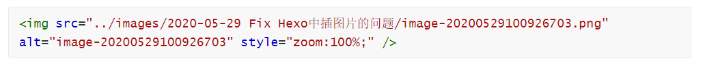

## 使用Typora编辑Markdown文件并插入图片

Typora对于图片插入的设置是十分方便的，可以使用剪贴板Ctrl+V直接把图片粘贴到Markdown文件中，Typora会根据设置自动将图片保存或复制到相应的文件夹中。（如果能支持对于不同的文件夹配置不同的路径就更好了，现在的设置是全局设置，有时候不太方便，不同项目有不同的文件组织方式，需要自己切换设置。）


这样插入的文件是长成下面的模样：


很可惜，这样插入的图片在Hexo博客中不能完整工作，在首页的文章中能正常显示，但是一旦点进文章中，就无法正常显示了。


## Hexo支持的图片插入格式

Hexo的[官方文档](https://hexo.io/zh-cn/docs/asset-folders.html)中提到，

> 通过常规的 markdown 语法和相对路径来引用图片和其它资源可能会导致它们在存档页或者主页上显示不正确。在Hexo 2时代，社区创建了很多插件来解决这个问题。但是，随着Hexo 3 的发布，许多新的标签插件被加入到了核心代码中。这使得你可以更简单地在文章中引用你的资源。
>
> ```
> 
> 
> 
> ```

但是如果我们使用标签来插入图片，那么图片虽然能在Hexo中显示，但是无法在Typora等markdown编辑器中显示，不便于我们可视化编辑，也不方便我们使用Markdown自动保存图片的功能。

另一种可以正常显示图片的方式是使用html标签，例如

```html

```

这种方式插入的图片是可以在首页和文章页都正确显示的。


如果我们在Typora中，对某个图片按右键，选择缩放图片，Typora就会自动的把图片从markdown语法转成和html标签语法，依然使用相对路径，例如



可以看到，只要我们稍微更改一下路径，去掉前边的两个点，就可以在Hexo博客中正常显示；但是更改路径之后，又不能在markdown编辑器中正常可视化了。


## 在Github Action中使用Sed自动修正

所以，让本地的版本和部署到Blog的版本不一致即可。

这个Blog已经使用了。我们在Action中的脚本中增加下边的命令，加在Build Hexo之前就行

```yaml
jobs:
  build:
    #...
    - name: sed images
      run: |
        sed  -i 's#<img src="../images/#<img src="/images/#g'  ./source/_posts/*.md
    - name: building
      run: |
        hexo g
    #...
```

这样，我们就可以既保证本地能用Typora可视化编辑，又能在Github Pages中正确渲染了。

