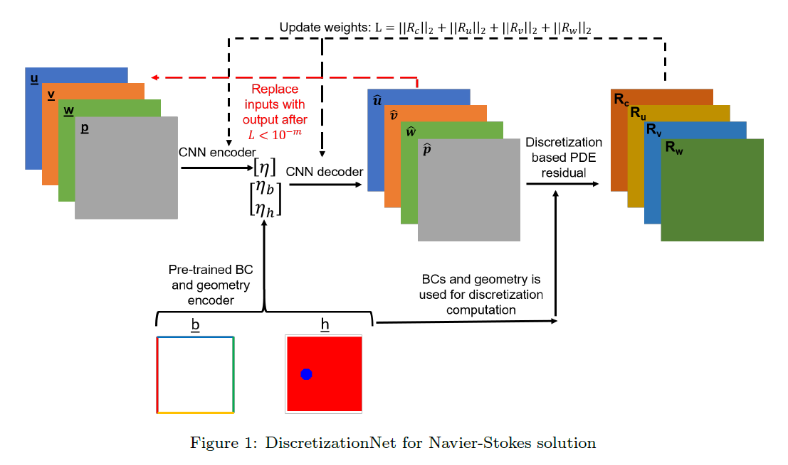
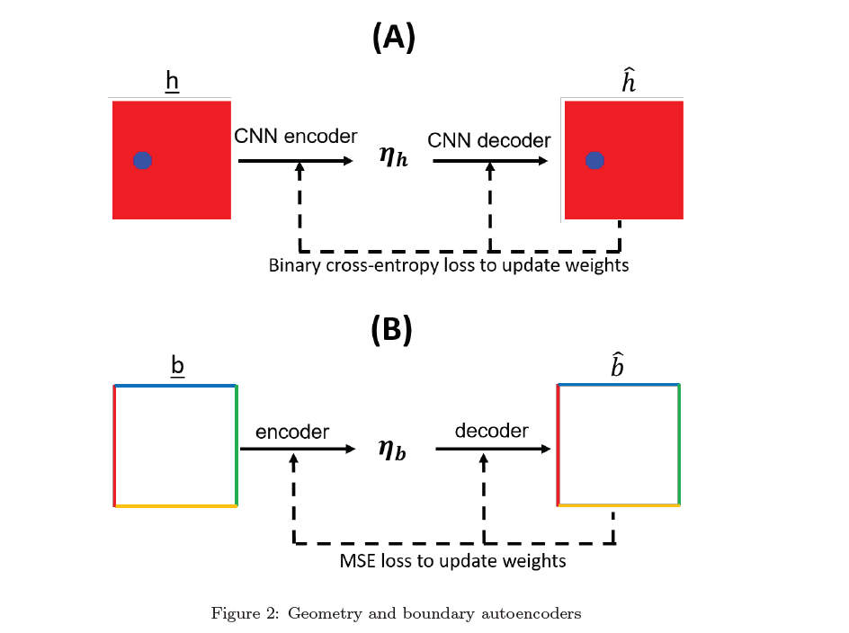
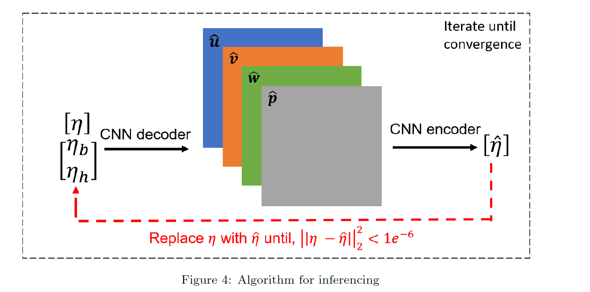

[arvix](https://arxiv.org/abs/2005.08357)

## 摘要

本文作者来自著名有限元分析软件开发商Ansys公司，提出了一种基于机器学习的NS方程求解器。

## Method

DiscretizationNet可以用来求解 **steady, incompressible Navier-Stokes equations**
$$
\left\{  
             \begin{array}{**lr**}  
             \nabla \cdot \boldsymbol v=0  \\  
             (\boldsymbol v \cdot \nabla)\boldsymbol v+\nabla p-\frac{1}{Re}\nabla^2 v=0
             \end{array}  
\right.
$$
其中$\boldsymbol v =(u,v,w)$，$\boldsymbol p$是scaled pressure。

### 网络结构

有一个Encode-Decoder网络，接受物理量($u,v,w,p$)的输入（solution space大小），输出同样尺度的物理量，希望输出的物理量比输入的物理量更接近方程的真解。其中encoder给出的latent space中的物理量要和 边界条件和geometry coder输出的code一起提供给decoder。相当于一个conditional autoencoder。

随后使用某种数值方法，例如有限体积法(文章中提到如果需要高阶精度，也可以用Finite Element Method (FEM), Discontinuous Galerkin (DG) ，此处用FVM是为了方便GPU并行加速)计算decoder输出的物理量在方程中的残差。

### Training Mechanics

传统的生成器网络可能会输入随机变量和condition vector,输出解，这样可能不太好训练，因为输出数据是一个随机变量的函数。

所以作者使用迭代的方法，每次decoder-encoder输入的是上次的输出。

训练的目的是通过极小化PDE残差生成方程的解，同时学习解的latent space。

如图，每次用Loss的梯度对encoder和decoder进行梯度下降即可。

我们可以注意到，每次训练网络时是data free的，也就是我们不需要PDE的真解，只需要每次计算PDE的残差即可。

### Geometry and Boundary encoder

对于几何形状和边界条件的encoder也很简单，就是一个autoencoder，在训练主网络（PDE求解器）之前pre train一下。

此外，Raynold数或者Prandtl数也可以视作边界条件，和边界条件的code一起供给decoder。

### Loss

$$
\lambda(W,b)=||\lambda_c||_{\Omega}+||\lambda_u||_{\Omega}+||\lambda_v||_{\Omega}+||\lambda_w||_{\Omega}
$$

$||\lambda_c||_{\Omega},||\lambda_u||_{\Omega},||\lambda_v||_{\Omega},||\lambda_w||_{\Omega}$分别表示continuity，和x,y,z方向动量的残差的L-2 norm。

### Inference for other geometry and boundary conditions

这部分最关键，就是训练好的网络如何拿来求解不同边值条件的NS方程。

因为我们训练网络时就用了不同的边值条件来训练，所以我们的网络自然而然的具有一定泛化性，可以求解不同边值条件的方程。我们先生成随机的初值，然后喂进网络里，取得输出再次输入，反复迭代，直到输出和输入基本一致时停止。此时的输入/输出值就是方程的解。

## 实验结果和结论

在以下三个案例中测试了 ML-solver 求解 the 3-D steady,incompressible Navier-Stokes equations

(i) lid-driven cavity, 

(ii) lamina row past a cylinder 

 (iii) conjugate heat transfer. 

结果显示和 ANSYS Fluent R19.3  有很好的一致性。

训练中使用不到30000步即可收敛，每步用时不到1s（在NVIDIA Tesla V100 SXM2 GPU.）。

实验结果中既展示了在训练集中的边界条件的解，在网络训练完成后，收敛到了接近真解的状态；也展示了不在训练集中的边界条件，在使用训练好的网络进行推断时，也能推断出好的解。但是测试的数据基本是训练数据的一种内插，即使用$\{0.2,0.4,0.6,0.8\}$的参数训练，测试0.5，和使用$\{8,20\}$训练，测试13。所以网络的泛化性可能有一定限制，不是对于所有的边界条件都用一个网络都能解决。但是对于相近的边界条件训练一个网络就可能足够了。

作者提出可以使用LSTM扩展ML-solver使得其能求解unsteady的问题。