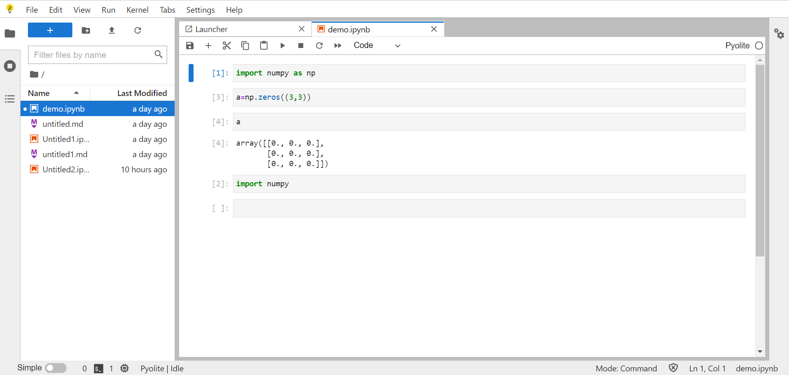

在对wasm进行了解的过程中，发现了一个可以静态部署的Jupyter环境。这样的jupyter环境可以很方便的部署到github pages等静态网站。

[JupyterLite — JupyterLite 0.1.0-alpha.11 documentation](https://jupyterlite.readthedocs.io/en/latest/)

而且这样的jupyter支持numpy和matplotlib等简单的数值计算用到的包，比较适合快速验证一些想法。文件可以存储在浏览器的Indexedb中，也可以下载到本地的电脑中。

这里就有一个例子：

[JupyterLite](/jupyter/lab/index.html)
