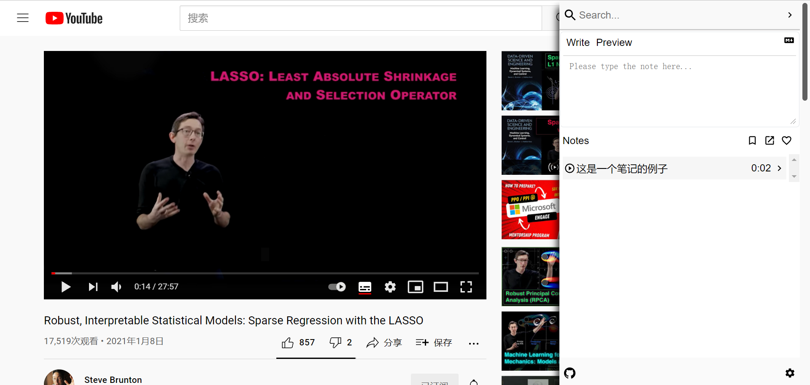
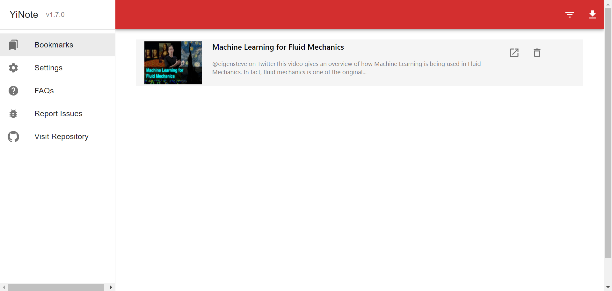

想在看视频时做一些简单的笔记，最常见的方法是拿一个本子用笔手写来记录。但是我想要做到笔记能翻回视频的时间点，然后就在网上找到了这样一款符合要求的软件。

[shuowu/yi-note: YiNote browser extension - online video note taking tool (github.com)](https://github.com/shuowu/yi-note)

这款软件的界面如下。首先是做笔记时的界面。

这个是笔记的管理页面。

支持播放下面几种视频时做笔记
-   Youtube video
-   Embedded youtube iframe video
-   HTML5 video
-   Local video via browser

支持基本的markdown语法（不支持latex公式），笔记存储在浏览器的indexedb中，可以导出成pdf。

对于bilibili的视频，B站有自己的视频笔记工具。
